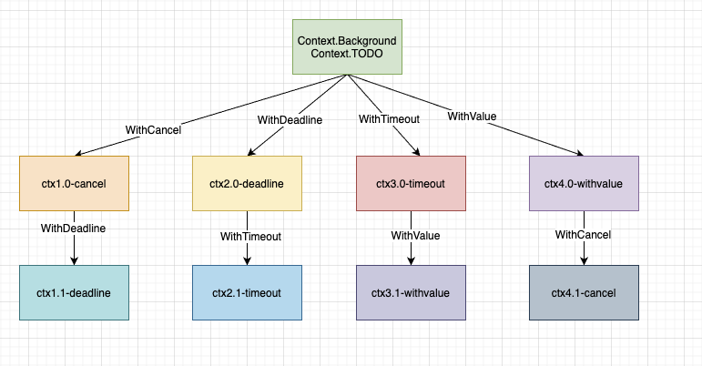
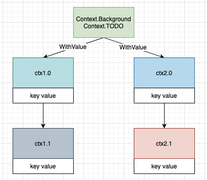

# `context`包的起源与作用

`context`可以用来在`goroutine`之间传递上下文信息，相同的`context`可以传递给运行在不同`goroutine`中的函数，上下文对于多个`goroutine`同时使用是安全的，`context`包定义了上下文类型，可以使用`background`、`TODO`创建一个上下文，在函数调用链之间传播`context`，也可以使用`WithDeadline`、`WithTimeout`、`WithCancel` 或 `WithValue` 创建的修改副本替换它，听起来有点绕，其实总结起就是一句话：`context`的作用就是在不同的`goroutine`之间同步请求特定的数据、取消信号以及处理请求的截止日期。

目前我们常用的一些库都是支持`context`的，例如`gin`、`database/sql`等库都是支持`context`的，这样更方便我们做并发控制了，只要在服务器入口创建一个`context`上下文，不断透传下去即可。

# `context`的使用

### 创建`context`

`context`包主要提供了两种方式创建`context`:

+ `context.Backgroud()`
+ `context.TODO()`

这两个函数其实只是互为别名，没有差别，官方给的定义是：

+ `context.Background` 是上下文的默认值，所有其他的上下文都应该从它衍生（Derived）出来。
+ `context.TODO` 应该只在不确定应该使用哪种上下文时使用；

所以在大多数情况下，我们都使用`context.Background`作为起始的上下文向下传递。

上面的两种方式是创建根`context`，不具备任何功能，具体实践还是要依靠`context`包提供的`With`系列函数来进行派生：

``` go
func WithCancel(parent Context) (ctx Context, cancel CancelFunc)
func WithDeadline(parent Context, deadline time.Time) (Context, CancelFunc)
func WithTimeout(parent Context, timeout time.Duration) (Context, CancelFunc)
func WithValue(parent Context, key, val interface{}) Context
```

这四个函数都要基于父`Context`衍生，通过这些函数，就创建了一颗Context树，树的每个节点都可以有任意多个子节点，节点层级可以有任意多个，画个图表示一下：



基于一个父`Context`可以随意衍生，其实这就是一个`Context`树，树的每个节点都可以有任意多个子节点，节点层级可以有任意多个，每个子节点都依赖于其父节点，例如上图，我们可以基于`Context.Background`衍生出四个子`context`：`ctx1.0-cancel`、`ctx2.0-deadline`、`ctx3.0-timeout`、`ctx4.0-withvalue`，这四个子`context`还可以作为父`context`继续向下衍生，即使其中`ctx1.0-cancel` 节点取消了，也不影响其他三个父节点分支。

创建`context`方法和`context`的衍生方法就这些，下面我们就一个一个来看一下他们如何被使用。

### `WithValue`携带数据

我们日常在业务开发中都希望能有一个`trace_id`能串联所有的日志，这就需要我们打印日志时能够获取到这个`trace_id`，在`python`中我们可以用`gevent.local`来传递，在`java`中我们可以用`ThreadLocal`来传递，在`Go`语言中我们就可以使用`Context`来传递，通过使用`WithValue`来创建一个携带`trace_id`的`context`，然后不断透传下去，打印日志时输出即可，来看使用例子：

``` go
const (
    KEY = "trace_id"
)

func NewRequestID() string {
    return strings.Replace(uuid.New().String(), "-", "", -1)
}

func NewContextWithTraceID() context.Context {
    ctx := context.WithValue(context.Background(), KEY,NewRequestID())
    return ctx
}

func PrintLog(ctx context.Context, message string)  {
    fmt.Printf("%s|info|trace_id=%s|%s",time.Now().Format("2006-01-02 15:04:05") , GetContextValue(ctx, KEY), message)
}

func GetContextValue(ctx context.Context,k string)  string{
    v, ok := ctx.Value(k).(string)
    if !ok{
        return ""
    }
    return v
}

func ProcessEnter(ctx context.Context) {
    PrintLog(ctx, "Golang梦工厂")
}


func main()  {
    ProcessEnter(NewContextWithTraceID())
}
```

输出结果：

``` go
2021-10-31 15:13:25|info|trace_id=7572e295351e478e91b1ba0fc37886c0|Golang梦工厂
Process finished with the exit code 0
```

我们基于`context.Background`创建一个携带`trace_id`的`ctx`，然后通过`context`树一起传递，从中派生的任何`context`都会获取此值，我们最后打印日志的时候就可以从`ctx`中取值输出到日志中。目前一些`RPC`框架都是支持了`Context`，所以`trace_id`的向下传递就更方便了。

在使用`withVaule`时要注意四个事项：

+ 不建议使用`context`值传递关键参数，关键参数应该显示的声明出来，不应该隐式处理，`context`中最好是携带签名、`trace_id`这类值。
+ 因为携带`value`也是`key`、`value`的形式，为了避免`context`因多个包同时使用`context`而带来冲突，`key`建议采用内置类型（基本类型）。
+ 上面的例子我们获取`trace_id`是直接从当前`ctx`获取的，实际我们也可以获取父`context`中的`value`，在获取键值对是，我们先从当前`context`中查找，没有找到会在从父`context`中查找该键对应的值直到在某个父`context`中返回 `nil` 或者查找到对应的值。
+ `context`传递的数据中`key`、`value`都是`interface`类型，这种类型编译期无法确定类型，所以不是很安全，所以在类型断言时别忘了保证程序的健壮性。

### 超时控制

通常健壮的程序都是要设置超时时间的，避免因为服务端长时间响应消耗资源，所以一些`web`框架或`rpc`框架都会采用`withTimeout`或者`withDeadline`来做超时控制，当一次请求到达我们设置的超时时间，就会及时取消，不在往下执行。`withTimeout`和`withDeadline`作用是一样的，就是传递的时间参数不同而已，他们都会通过传入的时间来自动取消`Context`，这里要注意的是他们都会返回一个`cancelFunc`方法，通过调用这个方法可以达到提前进行取消，不过在使用的过程还是建议在自动取消后也调用`cancelFunc`去停止定时减少不必要的资源浪费。

`withTimeout`、`WithDeadline`不同在于`WithTimeout`将持续时间作为参数输入而不是时间对象，这两个方法使用哪个都是一样的，看业务场景和个人习惯了，因为本质`withTimout`内部也是调用的`WithDeadline`。

现在我们就举个例子来试用一下超时控制，现在我们就模拟一个请求写两个例子：

- 达到超时时间终止接下来的执行

``` go
func main()  {
    HttpHandler()
}

func NewContextWithTimeout() (context.Context,context.CancelFunc) {
    return context.WithTimeout(context.Background(), 3 * time.Second)
}

func HttpHandler()  {
    ctx, cancel := NewContextWithTimeout()
    defer cancel()
    deal(ctx)
}

func deal(ctx context.Context)  {
    for i:=0; i< 10; i++ {
        time.Sleep(1*time.Second)
        select {
        case <- ctx.Done():
            fmt.Println(ctx.Err())
            return
        default:
            fmt.Printf("deal time is %d\n", i)
        }
    }
}
```

输出结果：

``` go
deal time is 0
deal time is 1
context deadline exceeded
```

+ 没有达到超时时间终止接下来的执行

``` go
func main()  {
    HttpHandler1()
}

func NewContextWithTimeout1() (context.Context,context.CancelFunc) {
    return context.WithTimeout(context.Background(), 3 * time.Second)
}

func HttpHandler1()  {
    ctx, cancel := NewContextWithTimeout1()
    defer cancel()
    deal1(ctx, cancel)
}

func deal1(ctx context.Context, cancel context.CancelFunc)  {
    for i:=0; i< 10; i++ {
        time.Sleep(1*time.Second)
        select {
        case <- ctx.Done():
            fmt.Println(ctx.Err())
            return
        default:
            fmt.Printf("deal time is %d\n", i)
            cancel()
        }
    }
}
```

输出结果：

``` go
deal time is 0
context canceled
```

使用起来还是比较容易的，既可以超时自动取消，又可以手动控制取消。这里大家要记的一个坑，就是我们往从请求入口透传的调用链路中的`context`是携带超时时间的，如果我们想在其中单独开一个goroutine去处理其他的事情并且不会随着请求结束后而被取消的话，那么传递的`context`要基于`context.Background`或者`context.TODO`重新衍生一个传递，否决就会和预期不符合了，可以看一下我之前的一篇踩坑文章：[context使用不当引发的一个bug](https://link.segmentfault.com/?enc=i8O5kLz1oIXkPeCM7fvxIg%3D%3D.F7xf4X0mRoou5rtbnccsX%2B37l3VzWH65Ngvnh%2FuTL%2BFUnZmgrzopUya%2BM04lk3VEacbpd8FgQBAlqWmhvsvm2Q%3D%3D)。

### `withCancel`取消控制

日常业务开发中我们往往为了完成一个复杂的需求会开多个`gouroutine`去做一些事情，这就导致我们会在一次请求中开了多个`goroutine`确无法控制他们，这时我们就可以使用`withCancel`来衍生一个`context`传递到不同的`goroutine`中，当我想让这些`goroutine`停止运行，就可以调用`cancel`来进行取消。

来看一个例子：

``` go
func main()  {
    ctx,cancel := context.WithCancel(context.Background())
    go Speak(ctx)
    time.Sleep(10*time.Second)
    cancel()
    time.Sleep(1*time.Second)
}

func Speak(ctx context.Context)  {
    for range time.Tick(time.Second){
        select {
        case <- ctx.Done():
            fmt.Println("我要闭嘴了")
            return
        default:
            fmt.Println("balabalabalabala")
        }
    }
}
```

运行结果：

``` go
balabalabalabala
....省略
balabalabalabala
我要闭嘴了
```

我们使用`withCancel`创建一个基于`Background`的ctx，然后启动一个讲话程序，每隔1s说一话，`main`函数在10s后执行`cancel`，那么`speak`检测到取消信号就会退出。

### 自定义`Context`

因为`Context`本质是一个接口，所以我们可以通过实现`Context`达到自定义`Context`的目的，一般在实现`Web`框架或`RPC`框架往往采用这种形式，比如`gin`框架的`Context`就是自己有封装了一层，具体代码和实现就贴在这里，有兴趣可以看一下`gin.Context`是如何实现的。

## 源码赏析

Context其实就是一个接口，定义了四个方法：

```go
type Context interface {
 Deadline() (deadline time.Time, ok bool)
 Done() <-chan struct{}
 Err() error
 Value(key interface{}) interface{}
}
```

- `Deadlne`方法：当`Context`自动取消或者到了取消时间被取消后返回，返回 context 的截止时间，通过此时间，函数就可以决定是否进行接下来的操作，如果时间太短，就可以不往下做了，否则浪费系统资源。当然，也可以用这个 deadline 来设置一个 I/O 操作的超时时间。
- `Done`方法：返回一个 channel，可以表示 context 被取消的信号：当这个 channel 被关闭时，说明 context 被取消了。注意，这是一个只读的channel。 我们又知道，读一个关闭的 channel 会读出相应类型的零值。并且源码里没有地方会向这个 channel 里面塞入值。换句话说，这是一个 `receive-only` 的 channel。因此在子协程里读这个 channel，除非被关闭，否则读不出来任何东西。也正是利用了这一点，子协程从 channel 里读出了值（零值）后，就可以做一些收尾工作，尽快退出。
- `Err`方法：当`Context`被取消或者关闭后，返回`context`取消的原因
- `Value`方法：获取设置的`key`对应的值

这个接口主要被三个类继承实现，分别是`emptyCtx`、`ValueCtx`、`cancelCtx`，采用匿名接口的写法，这样可以对任意实现了该接口的类型进行重写。

下面我们就从创建到使用来层层分析。

### 创建根`Context`

其在我们调用`context.Background`、`context.TODO`时创建的对象就是`empty`：

```go
var (
    background = new(emptyCtx)
    todo       = new(emptyCtx)
)

func Background() Context {
    return background
}

func TODO() Context {
    return todo
}
```

`Background`和`TODO`还是一模一样的，官方说：`background`它通常由主函数、初始化和测试使用，并作为传入请求的顶级上下文；`TODO`是当不清楚要使用哪个 Context 或尚不可用时，代码应使用 context.TODO，后续在在进行替换掉，归根结底就是语义不同而已。

#### `emptyCtx`类

`emptyCtx`主要是给我们创建根`Context`时使用的，其实现方法也是一个空结构，实际源代码长这样：

```go
type emptyCtx int

func (*emptyCtx) Deadline() (deadline time.Time, ok bool) {
    return
}

func (*emptyCtx) Done() <-chan struct{} {
    return nil
}

func (*emptyCtx) Err() error {
    return nil
}

func (*emptyCtx) Value(key interface{}) interface{} {
    return nil
}

func (e *emptyCtx) String() string {
    switch e {
    case background:
        return "context.Background"
    case todo:
        return "context.TODO"
    }
    return "unknown empty Context"
}
```

### `WithValue`的实现

`withValue`内部主要就是调用`valueCtx`类：

```go
func WithValue(parent Context, key, val interface{}) Context {
    if parent == nil {
        panic("cannot create context from nil parent")
    }
    if key == nil {
        panic("nil key")
    }
    if !reflectlite.TypeOf(key).Comparable() {
        panic("key is not comparable")
    }
    return &valueCtx{parent, key, val}
}
```

#### `valueCtx`类

`valueCtx`目的就是为`Context`携带键值对，因为它采用匿名接口的继承实现方式，他会继承父`Context`，也就相当于嵌入`Context`当中了

```go
type valueCtx struct {
    Context
    key, val interface{}
}
```

实现了`String`方法输出`Context`和携带的键值对信息：

```go
func (c *valueCtx) String() string {
    return contextName(c.Context) + ".WithValue(type " +
        reflectlite.TypeOf(c.key).String() +
        ", val " + stringify(c.val) + ")"
}
```

实现`Value`方法来存储键值对：

```go
func (c *valueCtx) Value(key interface{}) interface{} {
    if c.key == key {
        return c.val
    }
    return c.Context.Value(key)
}
```

看图来理解一下：



所以我们在调用`Context`中的`Value`方法时会层层向上调用直到最终的根节点，中间要是找到了`key`就会返回，否会就会找到最终的`emptyCtx`返回`nil`。

### `WithCancel`的实现

我们来看一下`WithCancel`的入口函数源代码：

```go
func WithCancel(parent Context) (ctx Context, cancel CancelFunc) {
    if parent == nil {
        panic("cannot create context from nil parent")
    }
    c := newCancelCtx(parent)
    propagateCancel(parent, &c)
    return &c, func() { c.cancel(true, Canceled) }
}
```

这个函数执行步骤如下：

- 创建一个`cancelCtx`对象，作为子`context`
- 然后调用`propagateCancel`构建父子`context`之间的关联关系，这样当父`context`被取消时，子`context`也会被取消。
- 返回子`context`对象和子树取消函数

我们先分析一下`cancelCtx`这个类。

#### `cancelCtx`类

`cancelCtx`继承了`Context`，也实现了接口`canceler`:

```go
type cancelCtx struct {
    Context

    mu       sync.Mutex            // protects following fields
    done     atomic.Value          // of chan struct{}, created lazily, closed by first cancel call
    children map[canceler]struct{} // set to nil by the first cancel call
    err      error                 // set to non-nil by the first cancel call
}
```

字短解释：

- `mu`：就是一个互斥锁，保证并发安全的，所以`context`是并发安全的
- `done`：用来做`context`的取消通知信号，之前的版本使用的是`chan struct{}`类型，现在用`atomic.Value`做锁优化
- `children`：`key`是接口类型`canceler`，目的就是存储实现当前`canceler`接口的子节点，当根节点发生取消时，遍历子节点发送取消信号
- `error`：当`context`取消时存储取消信息

这里实现了`Done`方法，返回的是一个只读的`channel`，目的就是我们在外部可以通过这个阻塞的`channel`等待通知信号。

具体代码就不贴了。我们先返回去看`propagateCancel`是如何做构建父子`Context`之间的关联。

#### `propagateCancel`方法

代码有点长，解释有点麻烦，我把注释添加到代码中看起来比较直观：

```go
func propagateCancel(parent Context, child canceler) {
  // 如果返回nil，说明当前父`context`从来不会被取消，是一个空节点，直接返回即可。
    done := parent.Done()
    if done == nil {
        return // parent is never canceled
    }

  // 提前判断一个父context是否被取消，如果取消了也不需要构建关联了，
  // 把当前子节点取消掉并返回
    select {
    case <-done:
        // parent is already canceled
        child.cancel(false, parent.Err())
        return
    default:
    }

  // 这里目的就是找到可以“挂”、“取消”的context
    if p, ok := parentCancelCtx(parent); ok {
        p.mu.Lock()
    // 找到了可以“挂”、“取消”的context，但是已经被取消了，那么这个子节点也不需要
    // 继续挂靠了，取消即可
        if p.err != nil {
            child.cancel(false, p.err)
        } else {
      // 将当前节点挂到父节点的childrn map中，外面调用cancel时可以层层取消
            if p.children == nil {
        // 这里因为childer节点也会变成父节点，所以需要初始化map结构
                p.children = make(map[canceler]struct{})
            }
            p.children[child] = struct{}{}
        }
        p.mu.Unlock()
    } else {
    // 没有找到可“挂”，“取消”的父节点挂载，那么就开一个goroutine
        atomic.AddInt32(&goroutines, +1)
        go func() {
            select {
            case <-parent.Done():
                child.cancel(false, parent.Err())
            case <-child.Done():
            }
        }()
    }
}
```

这段代码真正产生疑惑的是这个if、else分支。不看代码了，直接说为什么吧。因为我们可以自己定制`context`，把`context`塞进一个结构时，就会导致找不到可取消的父节点，只能重新起一个协程做监听。

#### `cancel`方法

最后我们再来看一下返回的`cancel`方法是如何实现，这个方法会关闭上下文中的 Channel 并向所有的子上下文同步取消信号：

```go
func (c *cancelCtx) cancel(removeFromParent bool, err error) {
  // 取消时传入的error信息不能为nil, context定义了默认error:var Canceled = errors.New("context canceled")
    if err == nil {
        panic("context: internal error: missing cancel error")
    }
  // 已经有错误信息了，说明当前节点已经被取消过了
    c.mu.Lock()
    if c.err != nil {
        c.mu.Unlock()
        return // already canceled
    }
  
    c.err = err
  // 用来关闭channel，通知其他协程
    d, _ := c.done.Load().(chan struct{})
    if d == nil {
        c.done.Store(closedchan)
    } else {
        close(d)
    }
  // 当前节点向下取消，遍历它的所有子节点，然后取消
    for child := range c.children {
        // NOTE: acquiring the child's lock while holding parent's lock.
        child.cancel(false, err)
    }
  // 节点置空
    c.children = nil
    c.mu.Unlock()
  // 把当前节点从父节点中移除，只有在外部父节点调用时才会传true
  // 其他都是传false，内部调用都会因为c.children = nil被剔除出去
    if removeFromParent {
        removeChild(c.Context, c)
    }
}
```

到这里整个`WithCancel`方法源码就分析好了，通过源码我们可以知道`cancel`方法可以被重复调用，是幂等的。

### `withDeadline`、`WithTimeout`的实现

先看`WithTimeout`方法，它内部就是调用的`WithDeadline`方法：

```go
func WithTimeout(parent Context, timeout time.Duration) (Context, CancelFunc) {
    return WithDeadline(parent, time.Now().Add(timeout))
}
```

所以我们重点来看`withDeadline`是如何实现的：

```go
func WithDeadline(parent Context, d time.Time) (Context, CancelFunc) {
  // 不能为空`context`创建衍生context
    if parent == nil {
        panic("cannot create context from nil parent")
    }
  
  // 当父context的结束时间早于要设置的时间，则不需要再去单独处理子节点的定时器了
    if cur, ok := parent.Deadline(); ok && cur.Before(d) {
        // The current deadline is already sooner than the new one.
        return WithCancel(parent)
    }
  // 创建一个timerCtx对象
    c := &timerCtx{
        cancelCtx: newCancelCtx(parent),
        deadline:  d,
    }
  // 将当前节点挂到父节点上
    propagateCancel(parent, c)
  
  // 获取过期时间
    dur := time.Until(d)
  // 当前时间已经过期了则直接取消
    if dur <= 0 {
        c.cancel(true, DeadlineExceeded) // deadline has already passed
        return c, func() { c.cancel(false, Canceled) }
    }
    c.mu.Lock()
    defer c.mu.Unlock()
  // 如果没被取消，则直接添加一个定时器，定时去取消
    if c.err == nil {
        c.timer = time.AfterFunc(dur, func() {
            c.cancel(true, DeadlineExceeded)
        })
    }
    return c, func() { c.cancel(true, Canceled) }
}
```

`withDeadline`相较于`withCancel`方法也就多了一个定时器去定时调用`cancel`方法，这个`cancel`方法在`timerCtx`类中进行了重写，我们先来看一下`timerCtx`类，他是基于`cancelCtx`的，多了两个字段：

```go
type timerCtx struct {
    cancelCtx
    timer *time.Timer // Under cancelCtx.mu.

    deadline time.Time
}
```

`timerCtx`实现的`cancel`方法，内部也是调用了`cancelCtx`的`cancel`方法取消：

```go
func (c *timerCtx) cancel(removeFromParent bool, err error) {
  // 调用cancelCtx的cancel方法取消掉子节点context
    c.cancelCtx.cancel(false, err)
  // 从父context移除放到了这里来做
    if removeFromParent {
        // Remove this timerCtx from its parent cancelCtx's children.
        removeChild(c.cancelCtx.Context, c)
    }
  // 停掉定时器，释放资源
    c.mu.Lock()
    if c.timer != nil {
        c.timer.Stop()
        c.timer = nil
    }
    c.mu.Unlock()
}
```

终于源码部分我们就看完了，现在你何感想？

## `context`的优缺点

`context`包被设计出来就是做并发控制的。

### 缺点

- 影响代码美观，现在基本所有`web`框架、`RPC`框架都是实现了`context`，这就导致我们的代码中每一个函数的一个参数都是`context`，即使不用也要带着这个参数透传下去，个人觉得有点丑陋。
- `context`可以携带值，但是没有任何限制，类型和大小都没有限制，也就是没有任何约束，这样很容易导致滥用，程序的健壮很难保证；还有一个问题就是通过`context`携带值不如显式传值舒服，可读性变差了。
- 可以自定义`context`，这样风险不可控，更加会导致滥用。
- `context`取消和自动取消的错误返回不够友好，无法自定义错误，出现难以排查的问题时不好排查。
- 创建衍生节点实际是创建一个个链表节点，其时间复杂度为O(n)，节点多了会掉支效率变低。

### 优点

- 使用`context`可以更好的做并发控制，能更好的管理`goroutine`滥用。
- `context`的携带者功能没有任何限制，这样我我们传递任何的数据，可以说这是一把双刃剑
- 网上都说`context`包解决了`goroutine`的`cancelation`问题