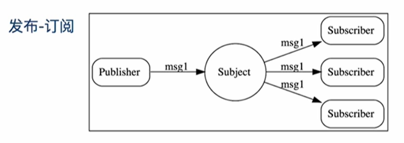
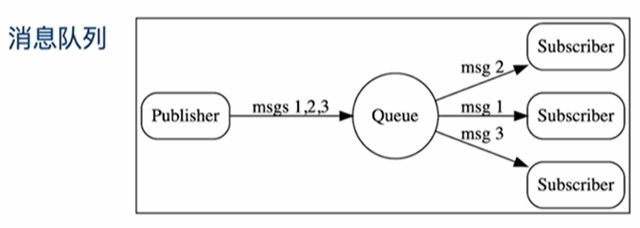
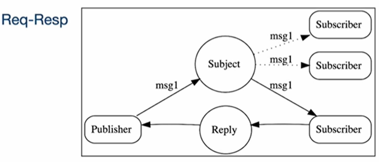
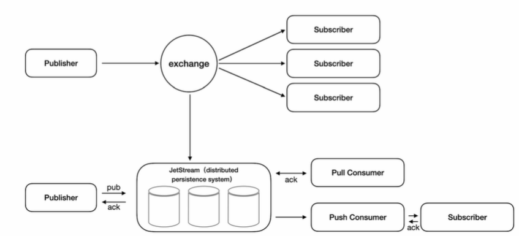
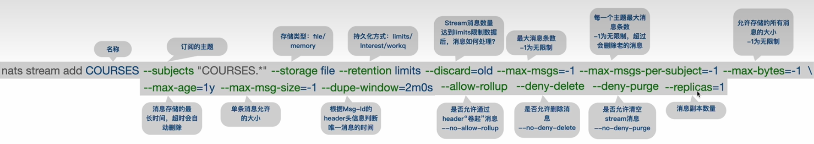
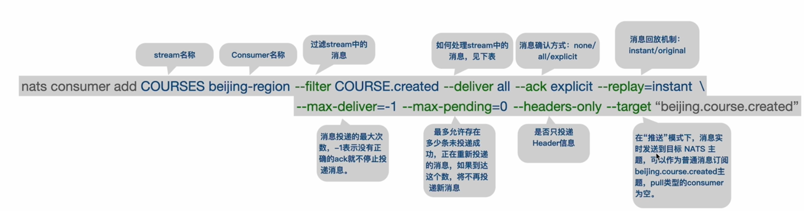
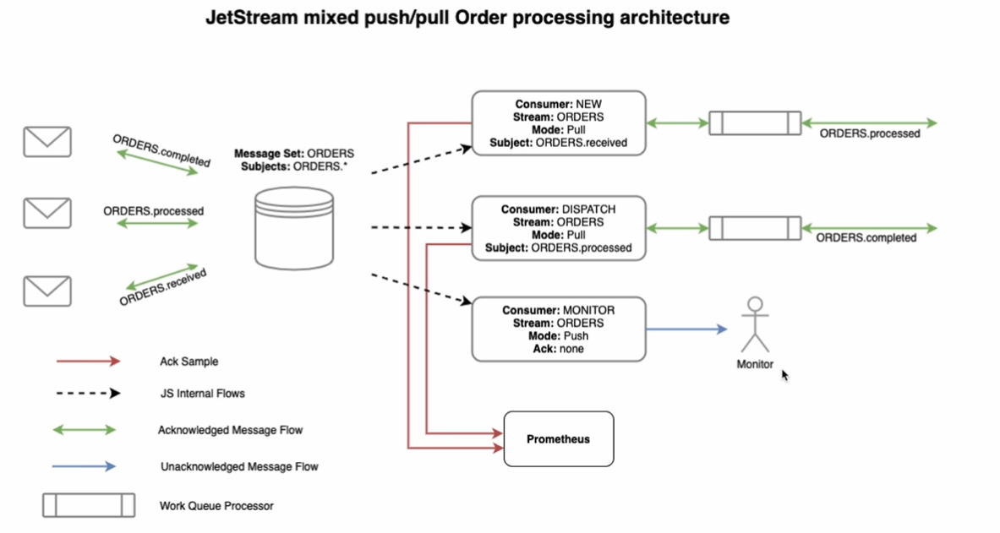

# 消息的基础知识

**<font color = red>主题（Subject/Topic）</font>**

主题就是一个字符串表示的名称，能确保发布者和订阅者可以使用该名称来查找对方。



**<font color = red>发布者（Publisher）</font>**

消息的发送方。



**<font color = red>订阅者（Subscriber）</font>**

消息的接收方（消费方）。



# NATS相关资源

+ 官方文档：https://nats.io/
+ 文档地址：https://docs.nats.io/
+ 源代码：https://github.com/nats-io（包括server、各种语言的SDK）
+ 下载：https://nats.io/download/（包括各种第三方工具）

# NATS主题

**<font color = red>主题（Subject/Topic）</font>**

主题就是一个字符串表示的名称。能确保发布者和订阅者可以使用该名称来查找对方

**<font color = red>主题命名</font>**

推荐字符：a to z，A to Z，0 to 9（大小写敏感，不能空格）

特殊字符：区分层次结构用“.”，两个通配符：“*”，“>”

**<font color = red>主题层次结构</font>**

order.sys

order.third

order.sys.created

order.third.finished

**<font color = red>通配符使用</font>**

+ 第一个通配符是<font color = red>`*`</font>，它将单个令牌匹配。例如，如果应用程序想收听东部时区，则他们可以订阅time.*.east，它将匹配time.us.east和time.eu.east


+ 第二个通配符是<font color = red>` >`</font>，它将匹配一个或多个标记，并且只能出现在主题的末尾。例如，time.us.>将匹配time.us.east和time.us.east.atlanta，而time.us.*仅匹配time.us.east，因为它不能匹配多个令牌


# JetStream

JetStream是NATS内置的分布式持久化存储系统（这样理解非常重要），构建在JetStream存储系统上的 ”core NATS“ 功能更多，消息可靠性更高



## 创建stream



## 创建Consumer



| DeliverPolicy          | 指定如何处理stream里的消息                             |
| ---------------------- | ------------------------------------------------------ |
| DeliverAll             | 默认配置，consumer需要处理从开始得所有消息             |
| DeliverLast            | 从处理流中的最后一条信息开始                           |
| DeliverLastPerSubject  | 第一个使用消息时，从当前流中每个主题的最后一条消息开始 |
| DeliverNew             | 只处理consumer创建后的消息                             |
| DeliverByStartSequence | 从指定的sequence开始处理                               |
| DeliverByStartTime     | 从指定的时间开始处理                                   |

## JetStream push/pull 混合消费者订单处理架构



``` go
package main

import (
	"github.com/nats-io/nats.go"
	"log"
	"strings"
)

func main() {
	nc, _ := nats.Connect("localhost:4222")
	js, _ := nc.JetStream()
	sub, _ := js.PullSubscribe("ORDERS.processed", "DISPATCH")
	for {
		msgs, _ := sub.Fetch(10)
		for _, msg := range msgs {
			orderInfo := strings.Split(string(msg.Data), ".")
			orderNo := orderInfo[0]
			log.Println("处理订单", orderNo)
			// TODO 在这儿处理各种业务，处理结束，推送ORDERS.completed
			_, err := js.Publish("ORDERS.processed", []byte(orderNo+",completed"))
			if err != nil {
				log.Println(err.Error())
				continue
			}
			log.Println("订单处理完毕：" + orderNo)
			err = msg.Ack()
		}
	}
}

```

# QoS

**<font color = red>At most once QoS</font>**

Core NATS 提供最多一次的服务质量。如果订阅者没有订阅主题（没有主题匹配），或者在发送消息时未处于活动状态，则不会收到消息。这与 TCP/IP 提供的保证级别相同。Core NATS 是一个即发即弃的消息传递系统。它只会将消息保存在内存中，并且永远不会将消息直接写入磁盘。

**<font color = red>At-least/exactly once QoS</font>**

如果您需要更高质量的服务（至少一次且恰好一次），或者诸如持久化消息，实现发布者与订阅者的解耦，键/值存储等功能，可以使用 NATS Jetstream，它内置在 NATS 服务器中（但需要启用）。

``` go
package main

import (
	"github.com/nats-io/nats.go"
	"log"
)

func main() {
	nc, _ := nats.Connect("localhost:4222")
	defer nc.Close()
	js, _ := nc.JetStream()
	header := nats.Header{}
	header.Add("Nats-Msg-Id", "1")
	msg := nats.Msg{
		Subject: "qtest.cj",
		Header:  header,
		Data:    []byte("hello11"),
	}
	_, err := js.PublishMsg(&msg)
	if err != nil {
		log.Println(err)
		return
	}
	log.Println("发送成功")
}
```

# K/V存储

JetStream 是 NATS 的持久层，不仅提供高可靠的消息服务，还对外提供了一套分布式K/V存储系统

 **<font color = red>Bucket、Key、Value</font>**

提供put、get、delete、purge、create、update、keys基础操作

TTL

 **<font color = red>其它增强功能</font>**

Watch

Watch all

History

``` go
package main

import (
	"fmt"
	"github.com/nats-io/nats.go"
	"log"
)

func main() {
	nc, _ := nats.Connect("localhost:4222")
	defer nc.Close()
	js, _ := nc.JetStream()

	// 创建bucket
	kv, err := js.CreateKeyValue(&nats.KeyValueConfig{
		Bucket: "mybkt",
	})

	if err != nil {
		log.Println(err)
		return
	}

	// 读写数据
	kv.Put("orderNo", []byte("1000101"))

	enty, _ := kv.Get("orderNo")
	fmt.Println(string(enty.Value()))
}
```

# NATS常用命令

``` go
// 1. 查看具体账户下的流
nats str ls --user mtcharge --password 654321
// 2. 查看具体账户下的流信息
nats str info --user mtcharge --password 654321
// 3. 根据配置文件新建流
nats str add CHARGING --config CHARGING.config --user mtcharge --password 654321
```

**CHARGING.config**

``` json
{
  "config": {
    "name": "CHARGING",
    "subjects": [
      "CHARGING.js.chargingInfo",
      "CHARGING.js.order"
    ],
    "retention": "workqueue",
    "max_consumers": -1,
    "max_msgs_per_subject": -1,
    "max_msgs": -1,
    "max_bytes": 10485760,
    "max_age": 0,
    "max_msg_size": -1,
    "storage": "file",
    "discard": "old",
    "num_replicas": 1,
    "duplicate_window": 120000000000,
    "sealed": false,
    "deny_delete": false,
    "deny_purge": false,
    "allow_rollup_hdrs": false
  },
  "created": "2022-08-29T07:33:04.00017216Z",
  "state": {
    "messages": 22,
    "bytes": 7343,
    "first_seq": 1,
    "first_ts": "2022-08-29T07:36:36.510294251Z",
    "last_seq": 24,
    "last_ts": "2022-08-30T00:45:01.886608373Z",
    "num_deleted": 2,
    "num_subjects": 1,
    "consumer_count": 2
  }
}


```

