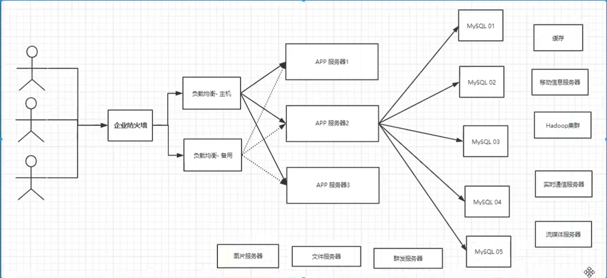
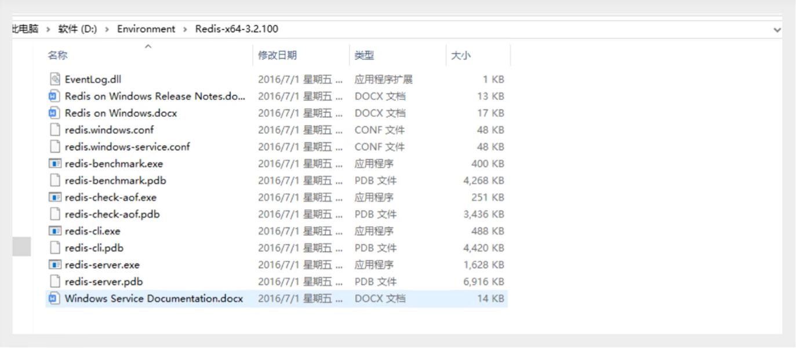
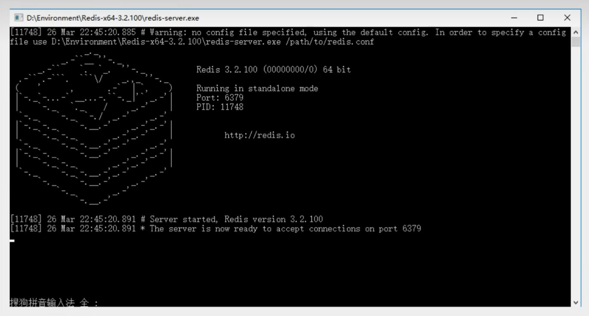

## 简介

+ nosql 讲解
+ 阿里巴巴架构演进
+ nosql 数据模型
+ nosql 四大分类
+ CAP
+ BASE
+ Redis 入门
+ Redis安装（Window & Linux 服务器）
+ 五大基本数据类型
  + String
  + List
  + Set
  + Hash
  + Zset
+ 三种特殊数据类型
  + geo
  + hyperloglog
  + bitmap
+ Redis 配置详解
+ Redis 持久化
  + RDB
  + AOF
+ Redis 事务操作
+ Redis 实现订阅发布
+ Redis 主从复制
+ Redis 哨兵模式
+ 缓存穿透及解决方案
+ 缓存击穿及解决方案
+ 缓存雪崩及解决方案
+ 基础 API 之 Jedis 详解
+ SpringBoot 集成 Redis 操作
+ Redis 的实践分析

## Nosql 概述

### 为什么要用 Nosql

> 1、单机MySQL的年代


整个网站的瓶颈

1、数据量如果太大、一个机器放不下了！

2、数据的索引，单表数据超过300万就一定要建立索引！

3、数据的索引（B+ Tree），一个机器内存也放不下

4、访问量（读写混合），一个服务器承受不了

> 2、Memcached（缓存）+ MySQL + 垂直拆分（读写分离）

网站80%的情况都是在读，每次都要去查询数据库的话就十分的麻烦！所以我们希望减轻数据的压力，我们可以使用缓存来保证效率！

发展过程：优化数据结构和索引 --> 文件缓存（IO）--> Memcached（当时最热门的技术）


>3、分开分表  + 水平区分 + MySQL集群

<font color = red>本质：数据库（读，写）</font>

MyISAM：表锁，十分影响效率！高并发下就会出现严重的锁问题

Innodb：行锁

慢慢的就开始使用分库分表来解决写的压力，MySQL的集群


> 4、如今最近的年代

2010 -- 2020 十年之间，世界已经发生了翻天覆地的变化；（定位，也是一种数据，音乐，热榜！）

MySQL 等关系型数据库就不够用了！数据量很多，变化很快~！

MySQL 有的使用它来存储一些比较大的文件，博客，图片！数据库表很大，效率就低了！如果有一种数据来专门来处理这种数据，MySQL压力就变得十分小（研究如何处理这些问题！）大数据得IO压力下，表几乎没法更改！

>目前一个基本的互联网项目！



> 为什么要用NoSQL！

用户的个人信息，社交网络，地理位置。用户自己产生的数据，用户日志等等爆发式增长！

这时候我们就需要使用 NoSQL 数据库的，NoSQL 可以很好的处理以上的情况！

### 什么是NoSQL

> NoSQL

NoSQL = Not Only SQL（不仅仅是SQL）

关系型数据库：表格，行，列

泛指非关系型数据库，随着web2.0互联网的诞生！传统的关系型数据库很难对付web2.0时代！尤其是超大规模的高并发的社区！暴露出来很多难以克服的问题。NoSQL在当今大数据环境下发展的十分迅速，Redis是发展最快的，而且是我们当下必须要掌握的一个技术！

很多的数据类型用户的个人信息，社交网络，地理位置。这些数据类型的存储不需要一个固定的格式！不需要多余的操作就可以横向扩展！map[string]interface{}{} 使用键值对来控制！

> NoSQL 特点

1、方便扩展（数据之间没有关系，很好扩展！）

2、大数据量高性能（Redis 一秒写8万次，读11万次，NoSQL的缓存记录级，是一种细粒度的缓存，性能会比较高！）

3、数据类型是多样性的！（不需要事先设计数据库！随取随用！）

4、传统的RDBMS 和 NoSQL

```
传统 RDBMS
- 结构化组织
- SQL
- 数据和关系都存在单独的表中 row col
- 数据操作，数据定义语言
- 严格的一致性
- 基础的事务
- ......
```

``` 
NoSQL
- 不仅仅是数据库
- 没有固定的查询语言
- 键值对存储，列存储，文档存储，图形数据库（社交关系）
- 最终一直性
- CAP 定理和 BASE（异地多活）
- 高性能，高性能，高可扩
- ......
```

> 了解：3V + 3高

大数据时代的3V：主要是描述问题的

1. 海量Volume
2. 多样Variety
3. 实时Velocity

大数据时代的3高：主要是对程序的要求

1. 高并发
2. 高可拓（随时水平拆分，机器不够了，可以扩展机器来解决）
3. 高性能

真正在公司的实践：NOSQL + RDBMS 一起使用才是最强的，阿里巴巴的架构演进

### NoSQL的四大分类

**KV键值对：**

+ 新浪：Redis
+ 美团：Redis + Tair
+ 阿里、百度：Redis + memecache

**文档型数据库（bson格式和json一样）：**

+ MongoDB（一般必须要掌握）
  + MongoDB 是一个基于分布式文件存储的数据库，C++编写，主要用来处理大量的文档！
  + MongoDB 是一个介于关系型数据库和非关系型数据库中间的产品！
  + MongoDB 是非关系型数据库中功能最丰富，最像关系型数据库的！
+ ConthDB

**列存储数据库**

+ HBase
+ 分布式文件系统

**图关系数据库**

+ 他不是存图形，放的是关系，比如：朋友圈社交网络，广告推荐！
+ Neo4j，InfoGrid

> 四者对比！

| 分类                | Examples举例                                    | 典型应用场景                                                 | 数据模型                                     | 优点                                                         | 缺点                                                         |
| ------------------- | :---------------------------------------------- | ------------------------------------------------------------ | -------------------------------------------- | ------------------------------------------------------------ | ------------------------------------------------------------ |
| 键值（key-value）   | Tokyo Cabinet/Tyrant,Redis,Voldemort,Oracle BDB | 内容缓存，主要用于处理大量数据的高访问负载，也用于一些日志系统等等。 | Key  指向Value的键值，通常用hash table来实现 | 查找速度快                                                   | 数据无结构化，通常只被当作字符串或者二进制数据               |
| 列存储数据库        | Cassandra，HBase，Riak                          | 分布式的文件系统                                             | 以列簇式存储，将同一列数据存在一起           | 查找速度快，可以扩展性强，更容易进行分布式扩展               | 功能相对局限                                                 |
| 文档型数据库        | CouchDB，MongoDB                                | Web应用（与Key-Value类似，Value是结构化的，不同的是数据库能够了解Value的内容） | Key-Value对应的键值对，Value为结构化数据     | 数据结构要求不严格，表结构可变，不需要像关系型数据库一样，需要预先定义表结构 | 查询性能不高，而且缺乏统一的查询语法                         |
| 图形（Graph）数据库 | Neo4J，InfoGrid，Infinite Graph                 | 社交网络，推荐系统等。专注于构建关系图谱                     | 图结构                                       | 利用图结构相关算法。比如最短路径寻址，N度关系查找等          | 很多时候需要对整个图做计算才能得出需要的信息，而且这种结构不太好做分布式的集群方案。 |

## Redis入门

### 概述

> Redis 是什么？

Redis（<font color = red>Re</font>mote <font color = red>Di</font>ctionary <font color = red>S</font>erver），及远程字典服务！


是一个开源使用ANSI C 语言的编写、支持网络、可基于内存亦可持久化的日志型、Key-Value数据库，并提供多种语言的API。

免费和开源！是当下最热门的 NoSQL 技术之一！也被人们称之为结构化数据库！

> Reids 能把干嘛？

1、内存存储、持久化、内存中是断电即失、所以说持久化很重要（rdb、aof）

2、效率高，可以用于高速缓存

3、发布订阅系统

4、地图信息分析

5、计数器、计时器（浏览量！）

6、......

> 特性

1、多样的数据类型

2、持久化

3、集群

4、事务

5、......

> 学习中需要用到的东西

1、官网：https://redis.io/

2、中文网：http://www.redis.cn/

3、下载地址：通过官网下载即可！


注意：Windows在GitHub上下载（停更很久呢！）

<font color = red>Redis推荐都是在Linux服务器上搭建的，我们是基于Linux学习！</font>

### Windows安装

1、下载安装包：https://github.com/dmajkic/redis/releases

2、下载完毕得到压缩包：


3、解压到自己电脑上的环境目录下的就可以的！Redis十分的小，只有5M



4、开启Redis，双击开启服务



5、使用Redis客户端来连接服务器


### Linux安装

1、下载安装包！`redis-7.0.12.tar.gz`

2、解压Redis的安装包！ 程序放至/opt目录下


3、进入解压后的文件可以看到redis的配置文件


4、基本环境安装

```bash
yum install gcc-c++  //安装C++环境

make  //自动下载所需配置

make install  // 确认（可以不执行）
```


5、redis的默认安装路径 `/usr/local/bin`


6、复制opt目录下的redis配置文件。复制至当前目录下


7、redis默认不是后台启动的，修改配置文件！


8、启动Redis服务！


9、使用redis-cli进行连接测试


10、查看redis的进程是否开启！


11、如何关闭Redis服务 `shutdown`


12、再次使用10命令查看进程是否存在

13、后面会使用单机多Redis启动集群测试！

### 测试性能

**reids-benchmark** 是一个压力测试工具

官方自带的性能测试工具

redis-benchmark 命令参数


简单测试：

```bash
# 测试：100并发连接  每个并发100000个请求
redis-benchmark -h localhost -p 6379 -c 100 -n 100000
```


### 基础的知识

redis默认有16个数据库


默认使用的是第0个

可以使用 select 进行切换数据库！

``` base
127.0.0.1:6379> select 3
OK
127.0.0.1:6379[3]> DBSIZE
(integer) 0
```


清除当前数据库 `flushdb`

清除全部数据库的内容 `FLUSHALL`

``` bash
127.0.0.1:6379[3]> flushdb
OK
127.0.0.1:6379[3]> keys *
(empty array)
127.0.0.1:6379[3]> FLUSHALL
OK
127.0.0.1:6379[3]> keys *
(empty array)
127.0.0.1:6379[3]> 
```

> Redis 是单线程！

明白Redis是很快的，官方表示，Redis是基于内存操作，CPU不是Redis性能瓶颈，Redis的瓶颈是根据机器的内存和网络带宽，既然可以使用单线程来实现，就使用单线程！所以就使用了单线程了！

Redis 是C语言写的，官方提供的数据为100000+的QPS，这个不比同样的使用key-value的Memecache差！

**Redis 为什么单线程还这么快？**

1、误区1：高性能的服务器一定是多线程的？

2、误区2：多线程（CPU上下文会切换！）一定比单线程效率高！

速度：CPU>内存>硬盘

核心：redis是将所有的数据全部放在内存中的，所以说使用单线程去操作效率就是最高的，多线程（CPU上下文会切换：耗时的操作！！！），对于内存系统来说，如果没有上下文切换效率就是最高的！多次读写都是在一个CPU上的，在内存情况下，这个就是最佳的方案！

## 五大数据类型

> 官网文档


全段翻译：

Redis 是一个开源（BSD许可）的，内存中的数据结构存储系统，它可以用作<font color =red>数据库</font>、<font color = red>缓存</font>和<font color =red>消息中间件MQ</font>。 它支持多种类型的数据结构，如 [字符串（strings）](http://www.redis.cn/topics/data-types-intro.html#strings)， [散列（hashes）](http://www.redis.cn/topics/data-types-intro.html#hashes)， [列表（lists）](http://www.redis.cn/topics/data-types-intro.html#lists)， [集合（sets）](http://www.redis.cn/topics/data-types-intro.html#sets)， [有序集合（sorted sets）](http://www.redis.cn/topics/data-types-intro.html#sorted-sets) 与范围查询， [bitmaps](http://www.redis.cn/topics/data-types-intro.html#bitmaps)， [hyperloglogs](http://www.redis.cn/topics/data-types-intro.html#hyperloglogs) 和 [地理空间（geospatial）](http://www.redis.cn/commands/geoadd.html) 索引半径查询。 Redis 内置了 [复制（replication）](http://www.redis.cn/topics/replication.html)，[LUA脚本（Lua scripting）](http://www.redis.cn/commands/eval.html)， [LRU驱动事件（LRU eviction）](http://www.redis.cn/topics/lru-cache.html)，[事务（transactions）](http://www.redis.cn/topics/transactions.html) 和不同级别的 [磁盘持久化（persistence）](http://www.redis.cn/topics/persistence.html)， 并通过 [Redis哨兵（Sentinel）](http://www.redis.cn/topics/sentinel.html)和自动 [分区（Cluster）](http://www.redis.cn/topics/cluster-tutorial.html)提供高可用性（high availability）。

> 单点登录

### Redis-Key

``` bash
127.0.0.1:6379[3]> keys *			# 查看所有的key
(empty array)
127.0.0.1:6379[3]> set name hyq		# set key
OK
127.0.0.1:6379[3]> get name
"hyq"
127.0.0.1:6379[3]> set age 1
OK
127.0.0.1:6379[3]> get age			# get key
"1"
127.0.0.1:6379[3]> EXISTS name  	# 判断当前的key是否存在
(integer) 1
127.0.0.1:6379[3]> exists name1
(integer) 0
127.0.0.1:6379[3]> move name 1 		# 移除当前的key
(integer) 1
127.0.0.1:6379[3]> keys *
1) "age"
127.0.0.1:6379[3]> expire name 10	# 设置key的过期时间，单位是秒
(integer) 1
127.0.0.1:6379[3]> ttl name
(integer) 5
127.0.0.1:6379[3]> type name		# 查看当前key的类型
string
```

### String（字符串）

``` bash
#########################################################################################
127.0.0.1:6379[3]> set key1 1			# 设置值
OK
127.0.0.1:6379[3]> get key1				# 获得值
"1"
127.0.0.1:6379[3]> keys *				# 查看所有key
1) "key1"
127.0.0.1:6379[3]> exists key1			# 判断某一个key是否存在
(integer) 1
127.0.0.1:6379[3]> append key1 "hello"	# 追加字符串，如果key不存在，就相当于set key
(integer) 6
127.0.0.1:6379[3]> get key1
"1hello"
127.0.0.1:6379[3]> strlen key1			# 获取字符串的长度！
(integer) 6
127.0.0.1:6379[3]> append key1 "hyq"
(integer) 9
127.0.0.1:6379[3]> strlen key1
(integer) 9
127.0.0.1:6379[3]> get key1
"1hellohyq"
#########################################################################################
# i++
# 步长 i+=

127.0.0.1:6379[3]> set views 0 		# 初始浏览量为0
OK
127.0.0.1:6379[3]> get views
"0"
127.0.0.1:6379[3]> incr views		# 自增1 浏览量+1
(integer) 1
127.0.0.1:6379[3]> incr views
(integer) 2
127.0.0.1:6379[3]> get views
"2"
127.0.0.1:6379[3]> decr views 		# 自减1 浏览量-1
(integer) 1
127.0.0.1:6379[3]> get views
"1"
127.0.0.1:6379[3]> incrby views 10 	# 可以设置步长，指定增量！
(integer) 11
127.0.0.1:6379[3]> decrby views 5
(integer) 6
#########################################################################################
#字符串范围 range

127.0.0.1:6379[3]> set key1 "hyq12323" 
OK
127.0.0.1:6379[3]> get key1
"hyq12323" 
127.0.0.1:6379[3]> getrange key1 0 3 	# 截取字符串[0,3]
"hyq1"
127.0.0.1:6379[3]> getrange key1 0 -1	# 获取全部字符串，和get key是一样的
"hyq12323"

# 替换！
127.0.0.1:6379[3]> set key2 abcdefg
OK
127.0.0.1:6379[3]> get key2
"abcdefg"
127.0.0.1:6379[3]> setrange key2 1 xx	#替换指定位置开始的字符串！
(integer) 7
127.0.0.1:6379[3]> get key2
"axxdefg"
#########################################################################################
# setex (set with expire)	设置过期时间
# setnx (set if not exist)	不存在再设置 (在分布式锁中会常常使用！)

127.0.0.1:6379> setex key3 30 "hello"	# 设置key3值为hello，30秒后过期
OK
127.0.0.1:6379> ttl key3
(integer) 25
127.0.0.1:6379> get key3
"hello"
127.0.0.1:6379> setnx mykey "redis"		# 如果mykey不存在，创建mykey
(integer) 1
127.0.0.1:6379> keys *
1) "mykey" 
127.0.0.1:6379> setnx mykey "MongoDB"	# 如果mykey存在，创建失败！
(integer) 0
127.0.0.1:6379> get mykey
"redis"
#########################################################################################
# mset	同时设置多个值
# mget	同时获取多个值

127.0.0.1:6379> mset k1 v1 k2 v2 k3 v3	# 同时设置多个值
OK
127.0.0.1:6379> keys *
1) "k3"
2) "k2"
3) "k1"
127.0.0.1:6379> mget k1 k2 k3			# 同时获取多个值
1) "v1"
2) "v2"
3) "v3"
127.0.0.1:6379> msetnx k1 v1 k4 v4		# msetnx 是一个原子性的操作，要么一起成功，要么一起失败！
(integer) 0
127.0.0.1:6379> get k4
(nil)
# 对象
set user:1 {name:zhangsan,age:3} 		# 设置一个user:1对象，值为json字符来保存一个对象！
# 这里的key是一个巧妙的设置：user:{id}:{filed},如此设置在Redis中是完全OK了！
127.0.0.1:6379> mset user:1:name zhangsan user:1:age 2
OK
127.0.0.1:6379> mget user:1:name user:1:age
1) "zhangsan"
2) "2"
#########################################################################################
# getset 先get然后在set

127.0.0.1:6379> getset db redis		# 如果不存在值，则返回 nil
(nil)
127.0.0.1:6379> get db
"redis"
127.0.0.1:6379> getset db mongodb	# 如果存在值，则获取原来的值，并设置新的值
"redis"
127.0.0.1:6379> get db
"mongodb"
```

数据结构是相同的！

String类似的使用场景：value除了是我们的字符串还可以是我们的数字！

+ 计数器
+ 统计多单位的数量 
+ 粉丝数
+ 对象缓存存储！

### List（列表）

基本的数据类型，列表

在redis里面，我们可以把list玩成栈，队列，阻塞队列！

所有的list命令都是用l开头的

``` bash
#########################################################################################

127.0.0.1:6379> lpush list one		# 将一个值或者多个值，插入到列表头部（左）
(integer) 1
127.0.0.1:6379> lpush list two
(integer) 2
127.0.0.1:6379> lpush list three
(integer) 3
127.0.0.1:6379> lrange list 0 -1	# 获取list中的值
1) "three"
2) "two"
3) "one"
127.0.0.1:6379> lrange list 0 1		# 通过区间获取具体的值！
1) "three"
2) "two"
127.0.0.1:6379> rpush list righr	# 将一个值或者多个值，插入到列表尾部部（右）
(integer) 4
127.0.0.1:6379> lrange list 0 -1
1) "three"
2) "two"
3) "one"
4) "righr"
#########################################################################################
# LPOP
# RPOP

127.0.0.1:6379> lrange list 0 -1
1) "three"
2) "two"
3) "one"
4) "righr"
127.0.0.1:6379> lpop list	# 移除list的第一个元素
"three"
127.0.0.1:6379> rpop list	# 移除list的最后一个元素
"righr"
127.0.0.1:6379> lrange list 0 -1
1) "two"
2) "one"
#########################################################################################
# lindex

127.0.0.1:6379> lindex list 1	# 通过下标获得list中的某一个值！
"one"
127.0.0.1:6379> lindex list 0
"two"
#########################################################################################
# llen

127.0.0.1:6379> lpush list one
(integer) 1
127.0.0.1:6379> lpush list two
(integer) 2
127.0.0.1:6379> lpush list three
(integer) 3
127.0.0.1:6379> llen list 			# 返回列表的长度
(integer) 3
########################################################################################## 移除指定的值！
# lrem

127.0.0.1:6379> lpush list three
(integer) 4
127.0.0.1:6379> lrange list 0 -1
1) "three"
2) "three"
3) "two"
4) "one"
127.0.0.1:6379> lrem list 1 one		# 移除list集合中指定个数的value，精确匹配
(integer) 1
127.0.0.1:6379> lrange list 0 -1
1) "three"
2) "three"
3) "two"
127.0.0.1:6379> lrem list 1 three
(integer) 1
127.0.0.1:6379> lrange list 0 -1
1) "three"
2) "two"
127.0.0.1:6379> lpush list three
(integer) 3
127.0.0.1:6379> lrem list 2 three
(integer) 2
127.0.0.1:6379> lrange list 0 -1
1) "two"
########################################################################################## trim 修剪；list 截断

27.0.0.1:6379> rpush mylist hello
(integer) 1
127.0.0.1:6379> rpush mylist hello1
(integer) 2
127.0.0.1:6379> rpush mylist hello2
(integer) 3
127.0.0.1:6379> rpush mylist hello3
(integer) 4
127.0.0.1:6379> ltrim mylist 1 2		# 通过下标截取指定的长度，这个list已经被改变了，截断了只剩下截取的元素！
OK
127.0.0.1:6379> lrange mylist 0 -1
1) "hello1"
2) "hello2"
########################################################################################## rpoplpush 移除列表的最后一个元素，将他移动到新的列表中！

127.0.0.1:6379> rpush list hello
(integer) 1
127.0.0.1:6379> rpush list hello1
(integer) 2
127.0.0.1:6379> rpush list hello2
(integer) 3
127.0.0.1:6379> rpoplpush list mylist	# 移除列表的最后一个元素，将他移动到新的列表中！
"hello2"
127.0.0.1:6379> lrange list 0 -1	# 查看原来的列表
1) "hello"
2) "hello1"
127.0.0.1:6379> lrange mylist 0 -1	# 查看目标列表中，确实存在改值！
1) "hello2"
########################################################################################## lset 将列表中指定下标的值替换为另外一个值，更新操作

127.0.0.1:6379> exists list		# 判断这个列表是否存在
(integer) 0
127.0.0.1:6379> lset list 0 item	# 如果不存在列表我们去更新就会报错
(error) ERR no such key
127.0.0.1:6379> lpush list value1
(integer) 1
127.0.0.1:6379> lrange list 0 0
1) "value1"
127.0.0.1:6379> lset list 0 item	# 如果存在，更新当前下表的值
OK
127.0.0.1:6379> lrange list 0 0
1) "item"
127.0.0.1:6379> lset list 1 other
(error) ERR index out of range
########################################################################################## linsert	将某一个具体的value插入到列表中某个元素的前面或者后面

127.0.0.1:6379> rpush mylist hello
(integer) 1
127.0.0.1:6379> rpush mylist world
(integer) 2
127.0.0.1:6379> linsert mylist before world other
(integer) 3
127.0.0.1:6379> lrange mylist 0 -1
1) "hello"
2) "other"
3) "world"
127.0.0.1:6379> linsert mylist after world new
(integer) 4
127.0.0.1:6379> lrange mylist 0 -1
1) "hello"
2) "other"
3) "world"
4) "new"
```

> 总结

+ 它实际上是一个链表，before Node after，left，right都可以插入值
+ 如果key不存在，创建新的链表
+ 如果key存在，新增内容
+ 如果移除了所有值，空链表，也代表不存在！
+ 在两边插入或者改动值，效率最高！中间元素，相对来说效率会低一点~

消息排队！消息队列（Lpush Rpop）！栈（Lpush Lpop）

### Set（集合）

Set中的值是不能重复的！

``` bash
#########################################################################################
127.0.0.1:6379> sadd myset hello	# set集合中添加元素
(integer) 1
127.0.0.1:6379> sadd myset world
(integer) 1
127.0.0.1:6379> sadd myset shuai
(integer) 1
127.0.0.1:6379> smembers myset	# 查看指定set的所有值
1) "hello"
2) "shuai"
3) "world"
127.0.0.1:6379> sismember myset hello	# 判断某一个值是不是在set集合中
(integer) 1
127.0.0.1:6379> sismember myset he
(integer) 0
#########################################################################################
127.0.0.1:6379> scard myset		# 获取set集合中的内容元素个数！
(integer) 3
#########################################################################################
127.0.0.1:6379> srem myset hello 	# 移除set集合中的指定元素
(integer) 1
127.0.0.1:6379> scard myset
(integer) 2
127.0.0.1:6379> smembers myset
1) "shuai"
2) "world"
#########################################################################################
# set 无序不重复集合。抽随机！
127.0.0.1:6379> srandmember myset	# 随机抽选出一个元素
"shuai"
127.0.0.1:6379> srandmember myset
"world"
127.0.0.1:6379> srandmember myset 2	# 随机抽选出指定个数元素
1) "heelo"
2) "h"
127.0.0.1:6379> srandmember myset 2
1) "hee"
2) "world"
#########################################################################################
# 删除指定的key，删除随机的key
127.0.0.1:6379> smembers myset
1) "heelo"
2) "he"
3) "shuai"
4) "heel"
5) "h"
6) "world"
7) "hee"
127.0.0.1:6379> spop myset		# 随机删除一些set集合中的元素！
"hee"
127.0.0.1:6379> spop myset
"shuai"
127.0.0.1:6379> smembers myset
1) "heelo"
2) "he"
3) "heel"
4) "h"
5) "world"
#########################################################################################
# 将一个指定的值，移动到另外一个set集合中
127.0.0.1:6379> sadd myset hello
(integer) 1
127.0.0.1:6379> sadd myset world
(integer) 1
127.0.0.1:6379> sadd myset hyq
(integer) 1
127.0.0.1:6379> sadd myset2 set2
(integer) 1
127.0.0.1:6379> smove myset myset2 hyq 	# 将一个指定的值，移动到另外一个set集合中
(integer) 1
127.0.0.1:6379> smembers myset
1) "hello"
2) "world"
127.0.0.1:6379> smembers myset2
1) "hyq"
2) "set2"
#########################################################################################
# 微博，B站，共同关注！（并集）
数字集合类
	- 差集
	- 交集
	- 并集
127.0.0.1:6379> sadd key1 a
(integer) 1
127.0.0.1:6379> sadd key1 b
(integer) 1
127.0.0.1:6379> sadd key1 c
(integer) 1
127.0.0.1:6379> sadd key2 c
(integer) 1
127.0.0.1:6379> sadd key1 d
(integer) 1
127.0.0.1:6379> sadd key2 e
(integer) 1
127.0.0.1:6379> sdiff key1 key2		# 差集
1) "b"
2) "d"
3) "a"
127.0.0.1:6379> sinter key1 key2	# 交集（共同好友就可以这样实现）
1) "c"
127.0.0.1:6379> sunion key1 key2	# 并集
1) "a"
2) "c"
3) "b"
4) "e"
5) "d"
```

微博，A用户将所有关注的人放在一个set集合中！将它的粉丝也放在一个集合中！

共同关注，共同爱好，二度好友，推荐好友！（六度分割理论）

### Hash（哈希）

Map集合，key-Map集合！这个值是一个map集合！本质和String类型没有多大区别，还是一个简单的key-value！

``` bash
#########################################################################################
127.0.0.1:6379> hset myhash field1 heyingqing	# set一个具体的key-value
(integer) 1
127.0.0.1:6379> hget myhash field1	# 获取一个字段值
"heyingqing"
127.0.0.1:6379> hmset myhash field1 hello field2 world	# set多个key-value
OK
127.0.0.1:6379> hmget myhash field1 field2	# 获取多个字段值
1) "hello"
2) "world"
127.0.0.1:6379> hgetall myhash	# 获取全部的数据
1) "field1"
2) "hello"
3) "field2"
4) "world"
127.0.0.1:6379> hdel myhash field1	# 删除hash指定key字段！对应的value值也就消失了
(integer) 1
127.0.0.1:6379> hgetall myhash
1) "field2"
2) "world"
#########################################################################################
127.0.0.1:6379> hset myhash field1 hello field2 world
(integer) 1
127.0.0.1:6379> hgetall myhash
1) "field2"
2) "world"
3) "field1"
4) "hello"
127.0.0.1:6379> hlen myhash		# 获取hash表的字段数量！
(integer) 2
#########################################################################################
127.0.0.1:6379> hexists myhash field1	# 判断hash中指定字段是否存在！
(integer) 1
127.0.0.1:6379> hexists myhash field3
(integer) 0
#########################################################################################
# 只获得所有field
# 只获得所有value
127.0.0.1:6379> hkeys myhash	# 只获得所有field
1) "field2"
2) "field1"
127.0.0.1:6379> hvals myhash	# 只获得所有value
1) "world"
2) "hello"
#########################################################################################
127.0.0.1:6379> hset myset field3 5	 
(integer) 1
127.0.0.1:6379> hincrby mybash field3 1	# 指定增量
(integer) 1
127.0.0.1:6379> hincrby mybash field3 -1
(integer) 0
127.0.0.1:6379> hincrby mybash field3 -1
(integer) -1
127.0.0.1:6379> hsetnx myhash field4 hello	# 如果不存在则可以设置
(integer) 1
127.0.0.1:6379> hsetnx myhash field4 world	# 如果存在则不能设置
(integer) 0
```

hash可以存变更数据 user name age，尤其是用户信息之类的，经常变动的信息！hash更适合对象的存储，String更适合字符串的存储！

### Zset（有序集合）

在Set的基础上，增加了一个值，set k1 v1  zset k1 score1 v1

``` bash
#########################################################################################
127.0.0.1:6379> zadd myset 1 one	# 添加一个值
(integer) 1
127.0.0.1:6379> zadd myset 2 two 3 three	# 添加多个值
(integer) 2
127.0.0.1:6379> zrange myset 0 -1
1) "one"
2) "two"
3) "three"
#########################################################################################
127.0.0.1:6379> zadd salary 2500 xiaohong	# 添加三个用户
(integer) 1
127.0.0.1:6379> zadd salary 5000 zhangsan
(integer) 1
127.0.0.1:6379> zadd salary 200 he
(integer) 1
# ZRANGEBYSCORE key min max
127.0.0.1:6379> zrangebyscore salary -inf +inf	# 显示全部的用户 从小到大！
1) "he"
2) "xiaohong"
3) "zhangsan"
127.0.0.1:6379> zrevrange salary 0 -1	# 显示全部的用户 从大到小！
1) "zhangsan"
2) "he
127.0.0.1:6379> zrangebyscore salary -inf +inf withscores	# 显示全部用户且附带成绩 
1) "he"
2) "200"
3) "xiaohong"
4) "2500"
5) "zhangsan"
6) "5000"
127.0.0.1:6379> zrangebyscore salary -inf 2500 withscores	# 显示工资小于2500员工的升序排序！
1) "he"
2) "200"
3) "xiaohong"
4) "2500"
#########################################################################################
127.0.0.1:6379> zrange salary 0 -1	
1) "he"
2) "xiaohong"
3) "zhangsan"
127.0.0.1:6379> zrem salary xiaohong	# 移除有序集合中指定元素
(integer) 1
127.0.0.1:6379> zrange salary 0 -1
1) "he"
2) "zhangsan"
127.0.0.1:6379> zcard salary			# 获取有序集合中的个数
(integer) 2
#########################################################################################
127.0.0.1:6379> zadd myset 1 hello
(integer) 1
127.0.0.1:6379> zadd myset 2 world
(integer) 1
127.0.0.1:6379> zadd myset 3 he
(integer) 1
127.0.0.1:6379> zcount myset 1 3	# 获取指定区间的成员数量
(integer) 3
127.0.0.1:6379> zcount myset 1 2
(integer) 2
```

案例思路：set排序，存储班级成绩表，工资表排序！

普通消息：1，重要消息：2，带权重进行判断！

排行榜应用实现，去Top N测试！

## 三种特殊数据类型

### geospatial（地理位置）

朋友的地位，附近的人，打车计算距离

Redis的Geo在Redis3.2版本就推出了！这个功能可以推算地理位置的信息，两地之间的距离，方圆几里的人！

只有六个命令

+ GEOADD
+ GEODIST
+ GEOHASH
+ GEOPOS
+ GEORADIUS
+ GEORADIUSBYMEMBER

> geoadd

**添加地址位置**

```bash
# 规则：两极无法添加，我们一般下载城市数据，直接通过程序一次性导入
# 参数 key-value（纬度、经度、名称）
# 有效经度从-180度到180度
# 有效纬度从-85.05112878度到85.05112878度
127.0.0.1:6379> geoadd China:city 116.40 39.90 beijing
(integer) 1
127.0.0.1:6379> geoadd China:city 121.47 31.23 shanghai
(integer) 1
127.0.0.1:6379> geoadd China:city 106.50 29.25 chongqi 114.05 22.52 shengzhen
(integer) 2
127.0.0.1:6379> geoadd China:city 120.16 30.24 hangzhou 108.96 34.26 xian
(integer) 2
```

> geopos

**获得当前定位：一定是一个坐标值！**

```bash
127.0.0.1:6379> geopos China:city beijing	# 获取指定城市的经度和纬度
1) 1) "116.39999896287918091"
   2) "39.90000009167092543"
127.0.0.1:6379> geopos China:city beijing shanghai
1) 1) "116.39999896287918091"
   2) "39.90000009167092543"
2) 1) "121.47000163793563843"
   2) "31.22999903975783553"
```

> geodist

**两人之间的距离！**

单位：

+ **m** 表示单位为米
+ **km** 表示单位为千米。
+ **mi** 表示单位为英里。
+ **ft** 表示单位为英尺

``` bash
127.0.0.1:6379> geodist China:city beijing shanghai		# 查看上海到北京的直线距离
"1067378.7564"
127.0.0.1:6379> geodist China:city beijing shanghai km
"1067.3788"
127.0.0.1:6379> geodist China:city beijing xian m
```

> georadius

**以给定的经纬度为中心，找出某一半径内的元素**

我附近的人如何实现？

+ 获取所有附近的人的定位，通过半径查询！
+ 所有的数据必须录入到同一个key中

``` bash
# 以110，30这个经纬度为中心，寻找方圆1000km内的城市
127.0.0.1:6379> georadius China:city 110 30 1000 km	
1) "chongqi"
2) "xian"
3) "shengzeheng"
4) "hangzhou"
127.0.0.1:6379> georadius China:city 110 30 500 km
1) "chongqi"
2) "xian"
# 显示到中心距离的位置
127.0.0.1:6379> georadius China:city 110 30 1000 km withdist
1) 1) "chongqi"
   2) "348.5169"
2) 1) "xian"
   2) "483.8340"
3) 1) "shengzeheng"
   2) "924.6408"
4) 1) "hangzhou"
   2) "977.5143"
# 显示他人的定位信息
127.0.0.1:6379> georadius China:city 110 30 1000 km withcoord
1) 1) "chongqi"
   2) 1) "106.49999767541885376"
      2) "29.24999907141905453"
2) 1) "xian"
   2) 1) "108.96000176668167114"
      2) "34.25999964418929977"
3) 1) "shengzeheng"
   2) 1) "114.04999762773513794"
      2) "22.5200000879503861"
4) 1) "hangzhou"
   2) 1) "120.1600000262260437"
      2) "30.2400003229490224"
# 限制显示的数量
127.0.0.1:6379> georadius China:city 110 30 1000 km withcoord withdist count 1
1) 1) "chongqi"
   2) "348.5169"
   3) 1) "106.49999767541885376"
      2) "29.24999907141905453"
127.0.0.1:6379> georadius China:city 110 30 1000 km withcoord withdist count 2 
1) 1) "chongqi"
   2) "348.5169"
   3) 1) "106.49999767541885376"
      2) "29.24999907141905453"
2) 1) "xian"
   2) "483.8340"
   3) 1) "108.96000176668167114"
      2) "34.25999964418929977" 
```

> geobyradiusbymember

**找出指定范围内的元素，中心的是给定的位置元素决定**

``` bash
# 找出位于指定元素周围的其他元素
127.0.0.1:6379> georadiusbymember China:city beijing 1000 km
1) "beijing"
2) "xian"
127.0.0.1:6379> georadiusbymember China:city shanghai 400 km
1) "hangzhou"
2) "shanghai"
```

> geohash

**返回一个或多个位置元素的Geohash表示**

该命令返回11个字符的Geohash字符串！

``` bash
# 将二维的经纬度转为一维的字符串，如果两个字符串越接近，那么距离越近！
127.0.0.1:6379> geohash China:city beijing xian
1) "wx4fbxxfke0"
2) "wqj6zky6bn0"
```

> geo 底层实现原理其实就是Zset！我们可以使用Zset命令来操作geo！

``` bash
127.0.0.1:6379> zrange China:city 0 -1		# 查看地图中全部元素
1) "chongqi"
2) "xian"
3) "shengzeheng"
4) "hangzhou"
5) "shanghai"
6) "beijing"
127.0.0.1:6379> zrem China:city shengzeheng	# 移除指定元素
(integer) 1
127.0.0.1:6379> zrange China:city 0 -1
1) "chongqi"
2) "xian"
3) "hangzhou"
4) "shanghai"
5) "beijing"
```

### Hyperloglog

> 什么是基数？

A{1,3,5,7,8}

基数（不重复的元素） =  5，可以接受误差！

> 简介

Redis Hyperloglog 基数统计的算法！

优点：占用的内存是固定，2^64 不同的元素的技术，只需要消费12KB内存！如果要从内存角度来比较的话 Hyperloglog首选！

**网页的UV（一个人访问一个网页多次，但是还是算作一个人！）**

传统的方式，set保存用户的id，然后就可以统计set中的元素数量作为标准判断！

这个这个方式如果保存大量的用户ID，就会比较麻烦！我们的目的是为了计数，而不是保存用户ID；

0.81% 错误率！统计UV任务，可以忽略不计的！

> 测试使用

``` bash
127.0.0.1:6379> pfadd mykey a b c d e f g h i j		# 创建第一组元素 mykey
(integer) 1
127.0.0.1:6379> pfcount mykey	# 统计 mykey 元素的基数数量
(integer) 10
127.0.0.1:6379> pfadd mykey2 i j z c v b n m	# 创建第二组元素 mykey2
(integer) 1
127.0.0.1:6379> pfcount mykey2
(integer) 8
127.0.0.1:6379> pfmerge mykey3 mykey mykey2		# 合并两组 mykey mykey2 => mykey3 并集
OK
127.0.0.1:6379> pfcount mykey3
(integer) 14
```

如果允许容错，那么一定可以使用 Hyperloglog

如果不允许容错，就使用set或者自己的数据类型即可！

### Bitmap

> 位存储

统计用户信息，活跃，不活跃！登录、未登录！打卡，365打卡！两个状态的，都可以使用Bitmap！

Bitmap 位图，数据结构！都是操作二进制位来进行记录，就只有0和1两个状态！

365天 = 365bit，1字节 = 8bit，46个字节左右！

> 测试

使用bitmap来记录周一到周日的打卡！

周一：1，周二：0，周三：0，周四：1……

``` bash
127.0.0.1:6379> setbit sign 0 1
(integer) 0
127.0.0.1:6379> setbit sign 1 0
(integer) 0
127.0.0.1:6379> setbit sign 2 0
(integer) 0
127.0.0.1:6379> setbit sign 3 1
(integer) 0
127.0.0.1:6379> setbit sign 4 1
(integer) 0
127.0.0.1:6379> setbit sign 5 0
(integer) 0
127.0.0.1:6379> setbit sign 6 0
(integer) 0
```

查看某一天是否有打卡！

``` bash
127.0.0.1:6379> getbit sign 3
(integer) 1
127.0.0.1:6379> getbit sign 6
(integer) 0
```

统计操作，统计打卡的天数！

``` bash
127.0.0.1:6379> bitcount sign	# 统计这周的打卡记录，就可以看到是否有全勤
(integer) 3
```

## 事务

Redis事务本质：一组命令的集合！一个事务中的所有命令都会被序列化，在事务执行过程中，会按照顺序执行！

一次性、顺序性、排他性！执行一系列的命令！

``` bash
---- 队列 set set set 执行 ----
```

<font color = red>Redis事务没有隔离级别的概念</font>

所有的命令在事务中，并没有直接被执行！只有发起执行命令的时候才会执行！Exec

<font color = red>Redis单条命令是保存原子性的，但是事务不保证原子性！</font>（要么同时成功，要是同时失败，原子性！）

redis的事务：

+ 开启事务（multi）
+ 命令入队（……）
+ 执行事务（exec）

> 正常执行事务！

``` bash
127.0.0.1:6379> multi				# 开启事务
OK
127.0.0.1:6379(TX)> set k1 v1 		# 命令入队
QUEUED
127.0.0.1:6379(TX)> set k2 v2
QUEUED
127.0.0.1:6379(TX)> get k2
QUEUED
127.0.0.1:6379(TX)> set k3 v3
QUEUED
127.0.0.1:6379(TX)> exec			# 执行事务
1) OK
2) OK
3) "v2"
4) OK
```

> 放弃事务！

``` bash
127.0.0.1:6379> multi			# 开启事务
OK
127.0.0.1:6379(TX)> set k1 v1
QUEUED
127.0.0.1:6379(TX)> set k2 v2
QUEUED
127.0.0.1:6379(TX)> set k4 v4
QUEUED
127.0.0.1:6379(TX)> discard		# 取消事务
OK
127.0.0.1:6379> get k4			# 事务队列中的命令都不会被执行
(nil)
```

> 编译型异常（代码有问题！命令有错！），事务中所有的命令都不会被执行！

``` bash
127.0.0.1:6379> multi
OK
127.0.0.1:6379(TX)> set k1 v1
QUEUED
127.0.0.1:6379(TX)> set k2 v2
QUEUED
127.0.0.1:6379(TX)> set k3 v3
QUEUED
127.0.0.1:6379(TX)> getset k3		# 错误的命令
(error) ERR wrong number of arguments for 'getset' command
127.0.0.1:6379(TX)> set k4 v4
QUEUED
127.0.0.1:6379(TX)> set k5 v5
QUEUED
127.0.0.1:6379(TX)> exec			# 执行事务报错
(error) EXECABORT Transaction discarded because of previous errors.
127.0.0.1:6379> get k5				# 所有的命令都没有执行
(nil)
```

> 运行时异常（1/0），如果事务队列中存在语法性，那么执行命令的时候，其他命令是可以正常执行的，错误命令抛出异常！

``` bash
127.0.0.1:6379> set k1 "v1"
OK
127.0.0.1:6379> multi
OK	
127.0.0.1:6379(TX)> incr k1		# 会执行失败
QUEUED
127.0.0.1:6379(TX)> set k2 v2
QUEUED
127.0.0.1:6379(TX)> set k3 v3
QUEUED
127.0.0.1:6379(TX)> get k3
QUEUED
127.0.0.1:6379(TX)> exec
1) (error) ERR value is not an integer or out of range # 虽然第一条命令报错，但是依然正常执行！
2) OK
3) OK
4) "v3"
127.0.0.1:6379> get k2
"v2"
127.0.0.1:6379> get k3
"v3"
```

> 监控！Watch（面试常问！）

**悲观锁：**

+ 很悲观，什么时候都会出问题，无论做什么都会加锁！

**乐观锁**

+ 很乐观，认为什么时候都不会出问题，所以不会上锁！更新数据的时候去判断一下，在此期间是否有人修改过这个数据
+ 获取version
+ 更新的时候比较version

> Redis的监视测试！

正常执行成功！

```bash
127.0.0.1:6379> set money 100
OK
127.0.0.1:6379> set out 0
OK
127.0.0.1:6379> watch money		# 监视 money 对象
OK
127.0.0.1:6379> multi			# 事务正常结束，数据期间没有发生变动，这个时候就会正常执行成功！
OK
127.0.0.1:6379(TX)> decrby money 20
QUEUED
127.0.0.1:6379(TX)> incrby out 20
QUEUED
127.0.0.1:6379(TX)> exec
1) (integer) 80
2) (integer) 20
```

测试多线程修改值，使用watch可以当作redis的乐观锁操作！

``` bash
127.0.0.1:6379> watch money
OK
127.0.0.1:6379> multi
OK
127.0.0.1:6379(TX)> decrby money 10
QUEUED
127.0.0.1:6379(TX)> incrby out 10
QUEUED
127.0.0.1:6379(TX)> exec	# 执行之前，另外一个线程，修改了我们的值，这个时候们就是导致事务执行失败
(nil)
```

如果修改失败，获取最新的值就好

``` bash
127.0.0.1:6379> unwatch		# 如果发现事务执行失败，先解锁
OK
127.0.0.1:6379> watch money	# 获取最新的值，再次监视，select version
OK
127.0.0.1:6379> multi
OK
127.0.0.1:6379(TX)> decrby money 10
QUEUED
127.0.0.1:6379(TX)> incrby out 10
QUEUED
127.0.0.1:6379(TX)> exec	# 比对监视的值是否发生了变化，如果没有变化，那么可以执行成功，否则失败
1) (integer) 990
2) (integer) 30
```

## Redis.conf 详解

启动的时候，就是通过配置文件来启动！

> 单位


1、配置文件unit单位对大小写不敏感

> 包含


就是好比我们学习Spring、Import、include

> 网络

```bash
bind 127.0.0.1			# 绑定的IP
protected-mode yes		# 保护模式
port					# 端口设置
```

> 通用

``` bash
daemonize yes 					# 以守护进程的方式运行，默认是no，我们需要自己开启为yes！

pidfile /var/run/redis_6379.pid	# 如果以后台的方式运行，我们就需要指定一个pid文件！

# 日志
# Specify the server verbosity level.
# This can be one of:
# debug (a lot of information, useful for development/testing)
# verbose (many rarely useful info, but not a mess like the debug level)
# notice (moderately verbose, what you want in production probably)	生产环境
# warning (only very important / critical messages are logged)
loglevel notice
logfile ""			# 生产日志文件位置名，如果为空，就为标准的输出
databases 16		# 数据库的数量，默认是16个数据库
always-show-logo no	# 是否总是显示LOGO
```

> 快照

持久化，在规定的时间内，执行了多少次操作，就会持久化到文件 .rdb .aof

redis是内存数据库，如果没有持久化，那么数据断电即失

``` bash
# 如果3600秒内，至少有1个key进行了修改，我们就进行持久化操作
# 如果300秒内，至少有100key进行了修改，我们就会进行持久化操作
# 如果600秒内，至少有10000key进行了修改，我们就会进行持久化操作
save 3600 1 300 100 60 10000
# 我们之后学习持久化，会自己定义这个测试

stop-writes-on-bgsave-error yes		# 持久化如果出错了，是否还需要继续工作

rdbcompression yes					# 是否压缩rdb文件，需要消耗一些CPU资源

rdbchecksum yes						# 保存rgb文件的时候，进行错误的检查校验！

dir ./								# rdb文件保存的目录！
```

> REPLICATION 复制，我们后面讲解主从复制的时候进行讲解


> SECURITY 安全

可以在这里设置redis密码，默认是没有密码的！

``` bash
127.0.0.1:6379> ping
PONG
127.0.0.1:6379> config get requirepass				# 获取redis的密码
1) "requirepass"
2) ""
127.0.0.1:6379> config set requirepass "123456"		# 设置redis的密码
OK
127.0.0.1:6379> ping
(error) NOAUTH Authentication required.				# 发现所有命令都没有权限
127.0.0.1:6379> config get requirepass
(error) NOAUTH Authentication required.
127.0.0.1:6379> auth "123456"						# 使用密码进行登录
OK
127.0.0.1:6379> config get requirepass
1) "requirepass"
2) "123456"
```

> CLIENTS 限制

``` bash
maxclients 10000				# 设置能连接上redis的最大客户端的数量
maxmemory <bytes>				# redis配置最大的内存容量
maxmemory-policy noeviction		# 内存到达上限的处理策略
    1·noeviction： 		直接返回错误，不淘汰任何已经存在的redis键
    2.allkeys-lru：		所有的键使用lru算法进行淘汰
    3.volatile-lru：		有过期时间的使用lru算法进行淘汰
    4.allkeys-random：	随机删除redis键
    5.volatile-random：	随机删除有过期时间的redis键
    6.volatile-ttl：		删除快过期的redis键
    7.volatile-lfu：		根据lfu算法从有过期时间的键删除
    8.allkeys-lfu：		根据lfu算法从所有键删除

```

> APPEND ONLY 模式 aof配置

```bash
appendonly no		 # 默认是不开启aof模式的，默认是rdb方式持久化的，在大部分的情况下，rdb完全够用！
appendfilename "appendonly.aof"	# 持久化的文件的名字

# appendfsync always		# 每次写入都会sync，消耗性能
appendfsync everysec		# 每秒执行一次sync，可能会丢失这1s的数据！
# appendfsync no			# 不执行sync，这个时候操作系统自己同步数据，速度最快！
```

## Redis持久化

Redis 是内存数据库，如果不将内存中的数据库状态保存到磁盘，那么一旦服务器进程退出，服务器中的数据库状态也会消失。所以Redis提供了持久化功能！

### RDB（Redis DataBase）

> 什么是RDB

在主从复制中，rdb就是备用了！放在从机上面！


在指定的时间间隔内将内存中的数据集快照写入磁盘，也就是行话讲的Snapshot快照，它恢复时是将快照文件直接读到内存里。

Redis会单独创建（fork）一个子进程来进行持久化，会先将数据写入到一个临时文件中，待持久化过程都结束了，再用这个临时文件替换上次持久化好的文件。整个过程中，主进程是不进行任何IO操作的，这就确保了极高的性能。如果需要进行大规模数据的恢复，且对于数据恢复的完整性不是非常敏感，那RDB方式要比AOF方式更加的高效。RDB的缺点是最后一次持久化后的数据可能丢失。我们默认的就是RDB，一般情况下不需要修改这个配置！

<font color = red>rdb保存的文件是 dump.rdb</font> 都是在我们配置文件中快照进行配置的！


> 触发机制

1、save的规则满足的情况下，会自动触发rdb规则

2、执行flushall命令，也会触发我们的rdb规则！

3、退出redis，也会产生rdb文件！

备份就自动生产一个dump.rdb文件


> 如何恢复rdb文件！

1、只需要将rdb文件放在redis启动目录，redis启动的时候会自动检查dump.rdb恢复其中的数据！

2、查看需要存在的位置

```bash
127.0.0.1:6379> config get dir	
1) "dir"
2) "/usr/local/bin"			# 如果在这个目录下存在dump.rdb文件，启动就会自动恢复其中的数据
```

优点：

1、适合大规模的数据恢复！

2、对数据完整性要求不高

缺点：

1、需要一定的时间间隔进行操作！如果redis意外宕机，这个最后一次修改数据接没有了！

2、fork进程的时候，会占用一定的内存空间！

### AOF（Append Only File）

将我们的所有命令都记录下来，history，恢复的时候就把这个文件全部在执行一遍！

> 是什么


以日志的形式来记录每个写操作，将Redis执行过的所有指令下来（读操作不记录），只许追加文件但不可以改写文件，redis启动之初会读取该文件重新构建数据，换言之，redis重启的话就根据日志文件的内容将写指令从前到后执行一次完成数据的恢复工作

<font color = red>Aof保存的是 appendonly.aof 文件</font>

> append


默认是不开启的，需要手动进行配置！我们只需要将 appendonly 改为yes就开启了aof！

重启，redis就可以生效！

如果这个 aof 文件有错误，这个时候 redis 是启动不起来的，我们需要修复这个aof文件

redis 给我们提供了一个工具`redis-check-aof --fix `


如果文件正常，重启就可以直接恢复了！


> 优点和缺点

优点：

1、每一次修改都同步，文件的完整会更加好！‘

2、每秒同步一次，可能会丢失一秒的数据

3、从不同步，效率最高的！
缺点：

1、相对于数据文件来说，aof远远大于rdb，修复速度也比rdb慢！

2、aof运行效率也要比rdb慢，所以我们redis默认的配置就是rdb持久化！

> 重写规则说明

aof默认就是文件的无限追加，文件就会越来越大！


如果aof文件大于64m，太大了！fork一个新的进程来将我们的文件进行重写！

**总结**

1、RDB 持久化方式能够在指定的时间间隔内对你的数据进行快照存储

2、AOF持久化方式记录每次对服条器写的操作，当服务器重启的时候会重新执行这些命今来恢复原始的数据，AOF命令以Redis协议追加保存每次写的操作到文件末尾，Redis还能对AOF文件进行后台重写，使得AOF文件的体积不至于过大。

3、<font color =red>只做缓存，如果你只希望你的数据在服务器运行的时候存在，你也可以不使用任何持久化。</font>

4、同时开启两种持久化方式

+ 在这种情况下，当redis重启的时候会优先载入AOF文件来恢复原始的数据，因为在通常情况下AOF文件保存的数据集要比RDB文件保存的数据集要完整。
+ RDB 的数据不实时，同时使用两者时服务器重启也只会找AOF文件，那要不要只使用AOF呢 ? 作者建议不要，因为RDB更适合用于备份数据库(AOF在不断变化不好备份 )，快速重启，而且不会有AOF可能潜在的Bug，留着作为一个万一的手段。

5、性能建议

+ 因为RDB文件只用作后备用途，建议只在Slave（从机）上持久化RDB文件，而且只要15分钟备份一次就够了，只保留 save 900 1这条规则。
+ 如果Enable AOF，好处是在最恶劣情况下也只会丢失不超过两秒数据，启动脚本较简单只load自己的AOF文件就可以了，代价是带来了持续的IO，二是AF rewrite 的最后将 rewrite 过程中产生的新数据写到新文件造成的阻塞几乎是不可避免的。只要硬盘许可，应该尽量减少AOF rewrite 的频率，AOF重写的基础大小默认值64M太小了，可以设到5G以上，默认超过原大小100%大小重写可以改到适当的数值。
+ 如果不Enable AOF，仅靠 Master-Slave Repllcation 实现高可用性也可以，能省掉一大笔10，也减少了rewrite时带来的系统波动。代价是如果Master（主机）/Slave（从机） 同时倒掉，会丢失十几分钟的数据，启动脚本也要比较两 Master/Slave 中的 RDB文件，载入较新的那个，微博就是这种架构。

## Redis 发布订阅

Redis发布订阅（pub/sub）是一种<font color =red>消息通信模式</font>：发送者（pub）发送消息，订阅者（sub）接收消息。

Redis客户端可以订阅任何数量的频道。

订阅/发布消息图：

第一个：消息发送者，第二个：频道，第三个：消息订阅者


下图展示了频道channel1，以及订阅这个频道的三个客户端 —— client2、client5 和 client1 之间的关系：


当有新消息通过 Publish 命令发送给频道-channel1 时，这个消息就会被发送给订阅它的三个客户端：


> 命令

这些命令被广泛用于构建即时通信应用，比如网络聊天室和实时广播、实时提醒等。


> 测试

订阅端：

``` bash
127.0.0.1:6379> SUBSCRIBE hyq		# 订阅一个频道
Reading messages... (press Ctrl-C to quit)
1) "subscribe"
2) "hyq"
3) (integer) 1
# 等待读取推送的信息
1) "message"	# 消息
2) "hyq"		# 频道
3) "iloveyou"	# 具体的消息
1) "message"
2) "hyq"
3) "helloRedis"
```

发送端：

``` bash
127.0.0.1:6379> PUBLISH hyq iloveyou			# 发送者发布消息到频道！
(integer) 1
127.0.0.1:6379> PUBLISH hyq helloRedis
(integer) 1
```

> 原理

Redis是使用C实现的，通过分析 Redis 源码里的 pubsub.c 文件，了解发布和订阅机制的底层实现，籍此加深对 Redis 的理解。

Redis 通过 PUBLISH、SUBSCRIBE 和 PSUBSCRIBE 等命令实现发布和订阅功能。

通过 SUBSCRIBE 命令订阅某频道后，redis-server 里维护了一个字典，字典的键就是一个个频道（channel）,而字典的值则是一个链表，链表中保存了所有订阅这 channel的客户端。SUBSCRIBE 命令的关键，就是将客户端添加到给定 channel 的订阅链表中。


通过 PUBLISH 命令向订阅者发送消息，redis-server 会使用给定的频道作为键，在它所维护的 channel 字典中查找记录了订阅个频道的所有客户端的链表，遍历这个链表，将消息发布给所有订阅者。

Pub/Sub 从字面上理解就是发布 ( Publish ) 与订阅( Subscribe )，在Redis中，你可以设定对某一个key值进行消息发布及消息订阅，当一个kev值上进行了消息发布后，所有订阅它的客户端都会收到相应的消息。这一功能最明显的用法就是用作实时消息系统，比如普通的即

时聊天，群聊等功能。

使用场景：

1、实时消息系统！

2、事实聊天！（频道当作聊天室，将信息回显给所有人即可）

3、订阅、关注系统都是可以的！

稍微复杂的场景我们就会使用消息中间件。

## Redis主从复制

### 概念

主从复制，是指将一台Redis服务器的数据，复制到其他的Redis服务器。前者称为主节点(master/leader)，后者称为从节点(slave/follower)；<font color = red>数据的复制是单向的，只能由主节点到从节点。</font>Master以写为主，Slave 以读为主。

<font color =red>默认情况下，每台Redis服务器都是主节点，</font>且一个主节点可以有多个从节点（或没有从节点），一个从节点只能有一个主节点。

**主从复制的作用主要包括：**

1、数据冗余：主从复制实现了数据的热备份，是持久化之外的一种数据冗余方式

2、故障恢复：当主节点出现问题时，可以由从节点提供服务，实现快速的故障恢复；实际上是一种服务的冗余。

3、负载均衡：在主从复制的基础上，配合读写分离，可以由主节点提供写服务，由从节点提供读服务（即写Redis数据时应用连接主节点，读Redis数据时应用连接从节点），分担服务器负载，尤其是在写少读多的场景下，通过多个从节点分担读负载，可以大大提高Redis服务器的并发量。

4、高可用（集群）基石：除了上述作用以外，主从复制还是哨兵和集群能够实施的基础，因此说主从复制是Redis高可用的基础。

一般来说，要将Redis运用于工程项目中，只使用一台Redis是万万不能的（宕机），原因如下：

1、从结构上，单个Redis服务器会发生单点故障，并且一台服务器需要处理所有的请求负载，压力较大。

2、从容量上，单个Redis服务器内存容量有限，就算一台Redis服务器内存容量为256G，也不能将所有内存用作Redis存储内存，一般来说，<font color = red>单台Redis最大使用内存不应该超过20G。</font>

电商网站上的商品，一般都是一次上传，无数次浏览的，说专业点也就是”多读少写”

对于这种场景，我们可以使用如下这种架构：


主从复制，读写分离！80%的情况下都是在进行读操作！为了减缓服务器的压力！架构中经常使用！一主二从！

### 环境配置

只配置从库，不用配置主库！

``` bash
127.0.0.1:6379> info replication		# 查看当前库的信息
# Replication
role:master								# 角色
connected_slaves:0						# 没有从机
master_failover_state:no-failover
master_replid:1a3742b284a61acba488a46425d8ccbd3c0d238c
master_replid2:0000000000000000000000000000000000000000
master_repl_offset:0
second_repl_offset:-1
repl_backlog_active:0
repl_backlog_size:1048576
repl_backlog_first_byte_offset:0
repl_backlog_histlen:0
```

复制3个配置文件，然后修改对应的信息

1、端口

2、pid 名字

3、log文件名字

4、dump.rdb 名字

修改完毕之后，启动我们的3个redis服务器，可以通过进程信息查看！


### 一主二从

<font color =red>默认情况下，每台Redis服务器都是主节点</font>
